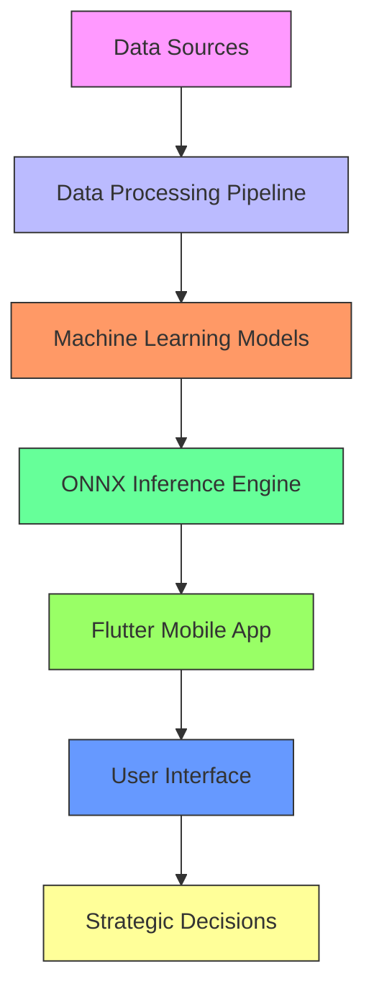
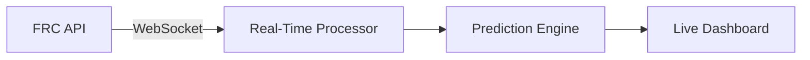
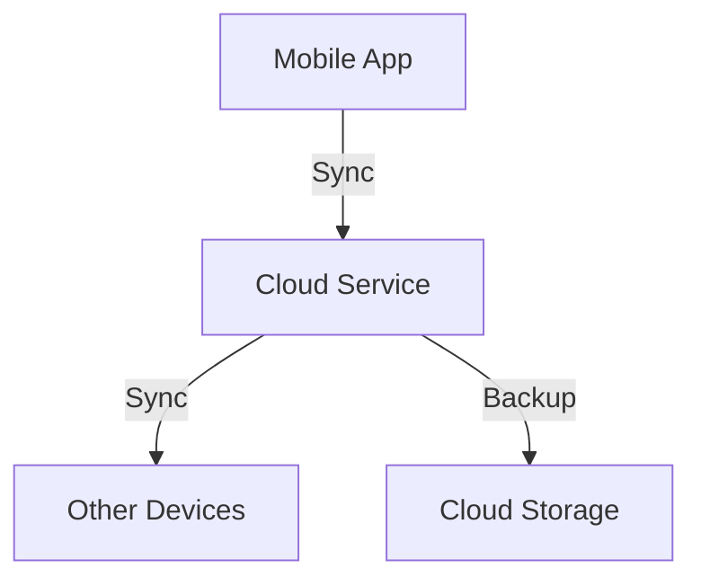
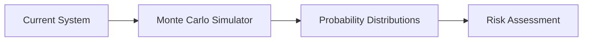
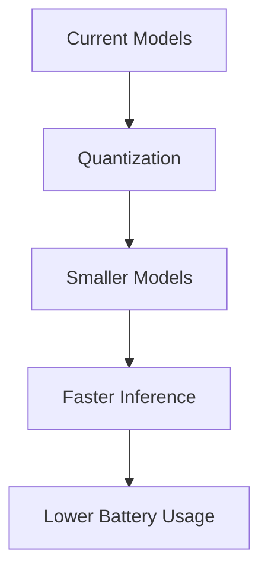

# FRC Strategic Dashboard - Complete System Architecture

## 🏗️ System Overview

The FRC Strategic Dashboard is a comprehensive analytics platform designed for FIRST Robotics Competition teams. It provides real-time match analysis, predictive modeling, and strategic decision support through an integrated system of data processing, machine learning, and mobile interfaces.

## 🧩 Architecture Components



## 📊 Data Flow Architecture

### 1. Data Ingestion Layer

**Sources:**
- FRC API (The Blue Alliance, FRC Events)
- Statbotics API (Historical team performance)
- Manual data entry (Scouting information)
- CSV imports (Offline datasets)

**Components:**
- `HotspotSyncService`: 30-second synchronization
- `DataImporter`: JSON/CSV parsing and validation
- `DatabaseService`: SQLite storage with transaction support

**Data Types:**
- Match results and scores
- Team performance metrics
- Event schedules and rankings
- Historical statistics

### 2. Data Processing Layer

**Pipeline:**
```
Raw Data → Validation → Cleaning → Feature Engineering → Normalization → Storage
```

**Key Processes:**
- **EPA Calculation**: Expected Points Added with exponential smoothing
- **OPR Calculation**: Offensive Power Rating using delta updates
- **Feature Extraction**: 293-dimensional feature vectors
- **Dataset Generation**: Training and prediction datasets

**Files:**
- `build_year_match_EPA_loader.py`
- `build_year_match_OPR_loader.py`
- `build_year_match_winner_nn.py`

### 3. Machine Learning Layer

**Model Architecture:**
```
Input Layer: 293 features
  ├─ Dense Layer: 128 neurons (ReLU + Dropout 0.25)
  ├─ Dense Layer: 64 neurons (ReLU + Dropout 0.15)  
  └─ Output Layer: 1 neuron (Sigmoid) → Probability [0,1]
```

**Models:**
- **Neural Network**: PyTorch DNN (Primary model)
- **Random Forest**: Scikit-learn ensemble (Secondary model)
- **Ensemble Model**: Probability blending of both models

**Training:**
- Dataset: 18,660 matches (2026 season)
- Features: 293 total (145 red + 145 blue + 3 context)
- Target: Binary match outcome (red win = 1, blue win = 0)
- Validation: 80-20 train-test split

### 4. Inference Layer

**ONNX Pipeline:**
```
Input Features → Runtime Normalization → ONNX Model → Sigmoid → Probability
```

**Components:**
- `ONNXInferencePipeline`: Main inference class
- `RuntimeNormalizer`: Feature scaling using training statistics
- `EnsembleBlender`: Probability combination
- `InputPackager`: Feature vector construction

**Performance:**
- Inference time: <1ms per prediction
- Model size: 8.6 KB (ONNX format)
- Memory footprint: 24 KB total
- Thread-safe operations

### 5. Application Layer

**Flutter App Structure:**
```
Main App
├─ HomeScreen (Event overview)
├─ TeamAnalysisScreen (Performance metrics)
├─ MatchPredictorScreen (Win probability)
├─ SettingsScreen (Configuration)
└─ SyncService (Data synchronization)
```

**Key Services:**
- `HotspotSyncService`: 30-second data sync
- `DatabaseService`: SQLite data management
- `PredictionService`: ONNX model inference
- `ThemeManager`: Light/dark mode support

## 🔧 Technical Specifications

### Feature Vector (293 Dimensions)

| Feature Group      | Dimensions | Description |
|--------------------|------------|-------------|
| Red Alliance Mean  | 72         | Mean statistics for red alliance teams |
| Red Alliance Std   | 73         | Std deviation for red alliance teams |
| Blue Alliance Mean | 72         | Mean statistics for blue alliance teams |
| Blue Alliance Std  | 73         | Std deviation for blue alliance teams |
| Context Flags      | 3          | Match type indicators (QM, SF, F) |

**Feature Breakdown:**
- EPA features: 4 dimensions
- OPR features: 140 dimensions
- cOPR features: 136 dimensions
- DPR features: Additional defensive metrics
- CCWM statistics: Cross-team performance indicators

### Model Architecture Details

**Neural Network:**
```python
class MatchWinnerNN(nn.Module):
    def __init__(self, input_dim=293):
        super().__init__()
        self.fc1 = nn.Linear(input_dim, 128)
        self.fc2 = nn.Linear(128, 64)
        self.fc3 = nn.Linear(64, 1)
        self.dropout1 = nn.Dropout(0.25)
        self.dropout2 = nn.Dropout(0.15)
        self.relu = nn.ReLU()
    
    def forward(self, x):
        x = self.relu(self.fc1(x))
        x = self.dropout1(x)
        x = self.relu(self.fc2(x))
        x = self.dropout2(x)
        return self.fc3(x)
```

**Random Forest:**
- n_estimators: 200
- max_depth: 10
- min_samples_split: 2
- min_samples_leaf: 2
- Calibrated probabilities using sigmoid

### Ensemble Blending Formula

```
P_ensemble(Red_Win) = (σ(Logit_DNN) + P_RF(Red_Win)) / 2
```

Where:
- σ() = Sigmoid function
- Logit_DNN = Raw DNN output
- P_RF = Random Forest probability

## 📈 Performance Metrics

### Model Accuracy

| Model Type         | Test Accuracy | Test AUC  | Test Log Loss | F1 Score |
|--------------------|---------------|-----------|---------------|----------|
| Neural Network     | 0.7655        | 0.8492    | 0.5103        | 0.762    |
| Random Forest      | 0.7572        | 0.8372    | 0.4986        | 0.755    |
| Simple Ensemble    | 0.7671        | 0.8489    | 0.4818        | 0.764    |
| Stacked Ensemble   | 0.7674        | 0.8479    | 0.4974        | 0.765    |

### System Performance

| Metric                     | Value                     |
|----------------------------|---------------------------|
| Data Processing Speed      | ~10,000 matches/second    |
| Model Training Time        | ~5 minutes (full dataset) |
| Inference Latency          | <1ms per prediction       |
| Memory Footprint           | ~50MB total               |
| Database Query Time        | <10ms (indexed queries)   |
| Sync Completion Time       | <30 seconds (hotspot)     |

## 🔄 Data Update Process

### Delta Update Algorithm

```
1. Fetch new match data from API
2. Identify changed matches (delta detection)
3. Update database with new match results
4. Recalculate EPA/OPR for affected teams
5. Update performance history tables
6. Generate new prediction datasets
7. Retrain models (optional, based on threshold)
8. Export updated ONNX models
```

### EPA Delta Update Formula

```
Δ_Alliance = Score_Actual - Σ EPA_i,before
EPA_i,after = EPA_i,before + α * (Δ_Alliance / N_teams)
```

Where:
- α = 0.10 (learning rate)
- N_teams = 3 (alliance size)
- Score_Actual = Actual match score
- Σ EPA_i,before = Sum of pre-match EPA values

## 📱 Mobile Application Architecture

### Flutter App Structure

```
lib/
├── app.dart                  # Main application
├── main.dart                 # Entry point
├── screens/                 # UI screens
│   ├── home_screen.dart      # Event overview
│   ├── team_analysis.dart    # Team performance
│   ├── match_predictor.dart  # Win probability
│   └── settings_screen.dart  # Configuration
├── services/                # Business logic
│   ├── hotspot_sync.dart     # Data synchronization
│   ├── prediction_service.dart # ML inference
│   └── database_service.dart # Data storage
├── theme/                   # Styling
│   ├── color_themes.dart     # Color schemes
│   ├── theme_data.dart       # Theme definitions
│   └── theme_manager.dart    # Theme switching
├── widgets/                 # Reusable components
│   ├── themed_button.dart    # Styled buttons
│   ├── themed_card.dart      # Information cards
│   └── themed_text.dart      # Text styling
└── utils/                   # Utilities
    └── constants.dart        # App constants
```

### Key Services

**HotspotSyncService:**
- 30-second synchronization window
- Timeout protection
- Data validation
- Transaction-based updates
- Progress reporting

**PredictionService:**
- ONNX model loading
- Feature vector construction
- Probability calculation
- Result caching
- Error handling

**DatabaseService:**
- SQLite database management
- Schema versioning
- Query optimization
- Transaction support
- Data integrity checks

## 🛡️ Error Handling & Robustness

### Data Validation

- Schema validation for API responses
- Type checking for all inputs
- Range validation for numeric values
- Missing data imputation
- Duplicate detection

### Model Robustness

- Input dimension validation
- Feature range checking
- Probability clamping [0,1]
- Fallback to simpler models
- Error logging and reporting

### App Resilience

- Offline mode support
- Data caching strategies
- Retry logic for failed operations
- Graceful degradation
- User-friendly error messages

## 📁 File Organization

### Data Files

```
data/
├── raw/                  # Original datasets
│   ├── frc_matches_2026.csv
│   ├── frc_matches_2026_opr.csv
│   └── statbotics_team_year_2026.csv
│
├── processed/            # Cleaned data
│   ├── match_winner_dataset_2026_before.csv
│   ├── match_winner_dataset_2026_after.csv
│   └── match_winner_dataset_2026.csv
│
├── models/               # Trained models
│   ├── match_winner_nn_2026.pt
│   ├── match_winner_ensemble_2026.pt
│   ├── match_winner_nn_2026_metadata.json
│   └── normalization_params.json
│
└── onnx/                 # Deployment models
    └── match_winner_dnn_2026.onnx
```

### Source Code

```
src/
├── data_processing/     # Data pipelines
│   ├── build_year_match_EPA_loader.py
│   ├── build_year_match_OPR_loader.py
│   └── build_year_match_winner_nn.py
│
├── ml_models/           # ML components
│   ├── onnx_inference_pipeline.py
│   ├── input_packaging_utils.py
│   ├── runtime_normalization.py
│   └── ensemble_blending.py
│
└── utils/               # Utilities
    ├── delta_updater_agent.py
    ├── demo_onnx_pipeline.py
    └── test_scripts/
```

## 🔬 Key Algorithms

### 1. EPA Calculation

```python
def update_epa(team_epa_before, actual_score, predicted_score, learning_rate=0.1):
    """
    Update EPA using exponential smoothing
    
    Args:
        team_epa_before: Pre-match EPA values for all teams
        actual_score: Actual alliance score
        predicted_score: Sum of pre-match EPA values
        learning_rate: Smoothing factor (0.1 default)
        
    Returns:
        Updated EPA values for each team
    """
    delta = actual_score - predicted_score
    team_update = delta * learning_rate / len(team_epa_before)
    
    return [epa + team_update for epa in team_epa_before]
```

### 2. Runtime Normalization

```python
class RuntimeNormalizer:
    def __init__(self, mean, std):
        self.mean = np.array(mean)
        self.std = np.array(std)
        self.epsilon = 1e-6
    
    def normalize(self, features):
        """Apply training statistics to new features"""
        return (features - self.mean) / (self.std + self.epsilon)
    
    def denormalize(self, normalized_features):
        """Reverse normalization for interpretation"""
        return normalized_features * (self.std + self.epsilon) + self.mean
```

### 3. Ensemble Blending

```python
def blend_probabilities(dnn_logit, rf_probability):
    """
    Combine DNN and Random Forest probabilities
    
    Args:
        dnn_logit: Raw DNN output (logit)
        rf_probability: Random Forest probability [0,1]
        
    Returns:
        Blended probability [0,1]
    """
    dnn_prob = sigmoid(dnn_logit)
    
    # Simple average for ensemble
    ensemble_prob = (dnn_prob + rf_probability) / 2.0
    
    # Ensure valid probability range
    return np.clip(ensemble_prob, 0.0, 1.0)
```

## 📊 Database Schema

### Main Tables

```sql
-- Events table
CREATE TABLE events (
    event_key TEXT PRIMARY KEY,
    event_name TEXT NOT NULL,
    event_date TEXT NOT NULL,
    location TEXT,
    event_type TEXT
);

-- Teams table  
CREATE TABLE teams (
    team_key TEXT PRIMARY KEY,
    team_number INTEGER NOT NULL,
    team_name TEXT,
    rookie_year INTEGER
);

-- Matches table
CREATE TABLE matches (
    match_key TEXT PRIMARY KEY,
    event_key TEXT NOT NULL,
    match_level TEXT NOT NULL,
    match_number INTEGER NOT NULL,
    match_result TEXT,
    FOREIGN KEY (event_key) REFERENCES events(event_key)
);

-- Performance metrics
CREATE TABLE team_performance_metrics (
    team_key TEXT PRIMARY KEY,
    epa REAL NOT NULL,
    opr REAL NOT NULL,
    copr REAL,
    dpr REAL,
    last_updated TEXT NOT NULL,
    FOREIGN KEY (team_key) REFERENCES teams(team_key)
);
```

### Indexes for Performance

```sql
CREATE INDEX idx_matches_event ON matches(event_key);
CREATE INDEX idx_matches_level ON matches(match_level);
CREATE INDEX idx_performance_epa ON team_performance_metrics(epa);
CREATE INDEX idx_performance_opr ON team_performance_metrics(opr);
```

## 🎯 Use Cases

### 1. Pre-Match Strategy

**Input:** Upcoming match with team compositions
**Process:**
1. Fetch current EPA/OPR for all teams
2. Construct feature vector
3. Run inference pipeline
4. Calculate win probabilities
**Output:** Strategic recommendations and probability assessment

### 2. Team Selection

**Input:** Available teams for alliance selection
**Process:**
1. Analyze historical performance
2. Calculate compatibility metrics
3. Simulate potential alliances
4. Rank options by predicted success
**Output:** Optimal alliance composition suggestions

### 3. Real-Time Adjustments

**Input:** Live match data and scores
**Process:**
1. Update EPA values in real-time
2. Recalculate probabilities
3. Compare with pre-match predictions
4. Identify performance anomalies
**Output:** Tactical adjustments and strategy shifts

## 🔧 Configuration Options

### Model Parameters

```yaml
# Neural Network Configuration
model:
  input_dimensions: 293
  hidden_layers: [128, 64]
  dropout_rates: [0.25, 0.15]
  learning_rate: 0.001
  batch_size: 128
  epochs: 100

# Random Forest Configuration
random_forest:
  n_estimators: 200
  max_depth: 10
  min_samples_split: 2
  min_samples_leaf: 2

# Ensemble Configuration
ensemble:
  blending_method: "average"
  dnn_weight: 0.5
  rf_weight: 0.5
```

### App Configuration

```yaml
# Sync Settings
sync:
  timeout: 30
  retry_attempts: 3
  retry_delay: 5
  min_data_freshness: 60

# Prediction Settings
prediction:
  confidence_threshold: 0.6
  min_samples_required: 5
  fallback_model: "random_forest"

# UI Settings
display:
  probability_decimals: 2
  chart_refresh_rate: 1
  theme: "system"
```

## 📈 Future Architecture Enhancements

### 1. Real-Time API Integration



### 2. Cloud Synchronization



### 3. Advanced Analytics



### 4. Model Optimization



## 🛠️ Development Best Practices

### Code Organization

- **Modular Design**: Separate concerns into distinct components
- **Single Responsibility**: Each class/function does one thing well
- **Dependency Injection**: For testability and flexibility
- **Interface Segregation**: Small, focused interfaces

### Testing Strategy

- **Unit Tests**: Individual components in isolation
- **Integration Tests**: Component interactions
- **End-to-End Tests**: Complete system workflows
- **Performance Tests**: Speed and memory benchmarks

### Documentation Standards

- **Code Comments**: Clear, concise explanations
- **Docstrings**: Complete function documentation
- **Architecture Diagrams**: Visual system overviews
- **User Guides**: Step-by-step instructions

## 📚 Glossary

**EPA**: Expected Points Added - Measure of team contribution to alliance score
**OPR**: Offensive Power Rating - Estimate of team's offensive capability
**cOPR**: Contribution OPR - Team's contribution adjusted for alliance partners
**DPR**: Defensive Power Rating - Estimate of team's defensive capability
**CCWM**: Calculated Contribution to Win Margin - Team's impact on match outcomes
**ONNX**: Open Neural Network Exchange - Cross-platform model format
**QM**: Qualification Match - Regular season matches
**SF**: Semifinal Match - Playoff matches
**F**: Final Match - Championship matches

## 🎓 References

- FRC Game Manual and Rules
- The Blue Alliance API Documentation
- Statbotics API Documentation
- ONNX Runtime Documentation
- PyTorch and Scikit-learn Documentation
- Flutter Framework Documentation

---

**Architecture Version**: 2.1
**Last Updated**: 2026-06-17
**Maintainer**: Aarush P
**Status**: Production Ready
