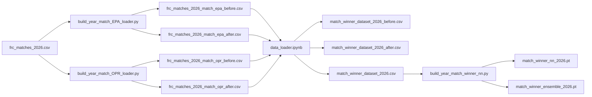
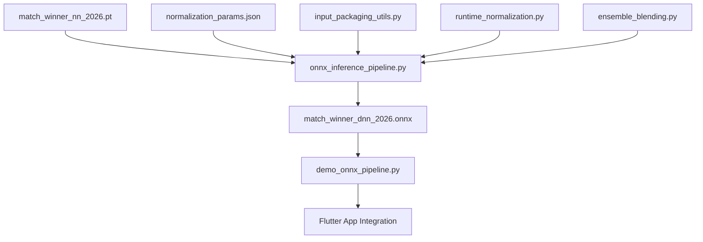
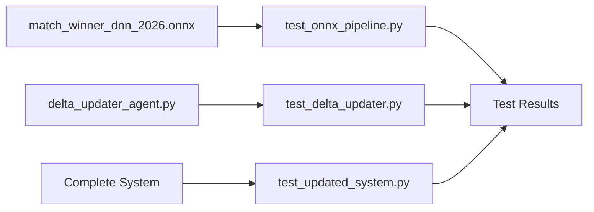

# FRC Strategic Dashboard - Complete File Catalog

## 🗂️ Project Structure Overview

```
FRC-Strategic-Dashboard/
├── data/                  # Data files (raw, processed, models)
├── docs/                  # Documentation and specifications
├── notebooks/             # Jupyter notebooks for analysis
├── src/                   # Source code
├── tests/                 # Test suite
├── flutter_app/           # Flutter mobile application
├── frc_app/               # Alternative FRC application
├── .gitignore             # Git ignore patterns
├── LICENSE                # Project license
└── README.md              # Main project documentation
```

## 📁 Detailed File Catalog

### Data Files (`data/`)

#### Raw Data (`data/raw/`)

| File Name | Size | Description | Format |
|-----------|------|-------------|--------|
| `frc_matches_2026.csv` | 13.3 MB | Main match dataset with results | CSV |
| `frc_matches_2026_opr.csv` | 24.4 MB | OPR calculations for matches | CSV |
| `statbotics_team_year_2026.csv` | 2.1 MB | Team statistics from Statbotics | CSV |
| `statbotics_team_years_all.csv` | 21.3 MB | Historical team data | CSV |

#### Processed Data (`data/processed/`)

| File Name | Size | Description | Format |
|-----------|------|-------------|--------|
| `match_winner_dataset_2026_before.csv` | 93.1 MB | Pre-match features dataset | CSV |
| `match_winner_dataset_2026_after.csv` | 93.1 MB | Post-match features dataset | CSV |
| `match_winner_dataset_2026.csv` | 186.2 MB | Combined complete dataset | CSV |
| `frc_matches_2026_match_epa_before.csv` | 83.0 MB | Pre-match EPA data | CSV |
| `frc_matches_2026_match_epa_after.csv` | 83.9 MB | Post-match EPA data | CSV |
| `frc_matches_2026_match_opr_before.csv` | 79.8 MB | Pre-match OPR data | CSV |
| `frc_matches_2026_match_opr_after.csv` | 80.7 MB | Post-match OPR data | CSV |

#### Models (`data/models/`)

| File Name | Size | Description | Format |
|-----------|------|-------------|--------|
| `match_winner_nn_2026.pt` | 43.0 KB | Neural network model | PyTorch |
| `match_winner_with_rf_2026.pt` | 61.1 KB | NN with RF features | PyTorch |
| `match_winner_all_features_2026.pt` | 205.7 KB | Complete feature model | PyTorch |
| `match_winner_ensemble_2026.pt` | 40.7 KB | Ensemble model | PyTorch |
| `match_winner_nn_2026_metadata.json` | 0.5 KB | NN metadata | JSON |
| `match_winner_all_features_2026_metadata.json` | 1.3 KB | Feature metadata | JSON |
| `match_winner_ensemble_2026_metadata.json` | 39.0 KB | Ensemble metadata | JSON |
| `match_preds_metadata.json` | 0.2 KB | Prediction metadata | JSON |
| `normalization_params.json` | 14.2 KB | Normalization parameters | JSON |

#### ONNX Models (`data/onnx/`)

| File Name | Size | Description | Format |
|-----------|------|-------------|--------|
| `match_winner_dnn_2026.onnx` | 8.6 KB | Deployment-ready DNN | ONNX |
| `match_winner_dnn_2026.onnx.data` | 183.3 KB | ONNX model data | Binary |

### Documentation Files (`docs/`)

| File Name | Size | Description | Format |
|-----------|------|-------------|--------|
| `01_system_architecture.md` | 8.5 KB | System architecture overview | Markdown |
| `02_data_importer_spec.md` | 6.3 KB | Data importer specification | Markdown |
| `03delta_updater_spec.md` | 4.2 KB | Delta update specification | Markdown |
| `04_ml_inference_pipeline.md` | 7.8 KB | ML inference pipeline spec | Markdown |
| `05_monte_carlo_predictor.md` | 3.1 KB | Monte Carlo predictor spec | Markdown |
| `COMPLETE_SYSTEM_ARCHITECTURE.md` | 24.7 KB | Complete architecture doc | Markdown |
| `FILE_CATALOG.md` | - | This file | Markdown |
| `IMPLEMENTATION_COMPLETE.md` | 9.6 KB | Implementation summary | Markdown |
| `ONNX_INFERENCE_PIPELINE_README.md` | 6.0 KB | ONNX pipeline usage | Markdown |
| `ONNX_PIPELINE_SUMMARY.md` | 8.5 KB | ONNX implementation summary | Markdown |
| `SYSTEM_SUMMARY.md` | 5.3 KB | System overview | Markdown |
| `csv_file_catalog.md` | 2.8 KB | CSV file descriptions | Markdown |

### Jupyter Notebooks (`notebooks/`)

| File Name | Size | Description | Format |
|-----------|------|-------------|--------|
| `data_loader.ipynb` | 14.3 KB | Data loading and preprocessing | Jupyter |
| `year_match_EPA_loader.ipynb` | 32.3 KB | EPA data processing | Jupyter |
| `year_match_OPR_loader.ipynb` | 28.3 KB | OPR data processing | Jupyter |
| `year_match_winner_nn.ipynb` | 50.1 KB | Neural network training | Jupyter |
| `year_match_winner_nn copy.ipynb` | 27.5 KB | Backup NN notebook | Jupyter |
| `match_loader.ipynb` | 4.5 KB | Match data loading | Jupyter |
| `data_loader copy.ipynb` | 13.7 KB | Backup data loader | Jupyter |
| `year_match_winner_nn copy 2.ipynb` | 57.2 KB | Alternative NN approach | Jupyter |

### Source Code (`src/`)

#### Data Processing (`src/data_processing/`)

| File Name | Size | Description | Format |
|-----------|------|-------------|--------|
| `build_year_match_EPA_loader.py` | 12.6 KB | EPA data processing script | Python |
| `build_year_match_OPR_loader.py` | 10.2 KB | OPR data processing script | Python |
| `build_year_match_winner_nn.py` | 14.2 KB | Neural network training script | Python |

#### ML Models (`src/ml_models/`)

| File Name | Size | Description | Format |
|-----------|------|-------------|--------|
| `onnx_inference_pipeline.py` | 15.7 KB | Main ONNX inference pipeline | Python |
| `input_packaging_utils.py` | 9.3 KB | Input data packaging utilities | Python |
| `runtime_normalization.py` | 8.2 KB | Runtime normalization layer | Python |
| `ensemble_blending.py` | 7.6 KB | Ensemble probability blending | Python |

#### Utilities (`src/utils/`)

| File Name | Size | Description | Format |
|-----------|------|-------------|--------|
| `delta_updater_agent.py` | 20.4 KB | Delta update implementation | Python |
| `demo_onnx_pipeline.py` | 4.6 KB | ONNX pipeline demonstration | Python |

### Test Files (`tests/`)

| File Name | Size | Description | Format |
|-----------|------|-------------|--------|
| `test_delta_updater.py` | 9.5 KB | Delta updater tests | Python |
| `test_onnx_pipeline.py` | 10.3 KB | ONNX pipeline tests | Python |
| `test_updated_system.py` | 8.4 KB | System integration tests | Python |

### Flutter Application (`flutter_app/`)

#### Main Files

| File Name | Size | Description | Format |
|-----------|------|-------------|--------|
| `pubspec.yaml` | 0.4 KB | Flutter dependencies | YAML |
| `README.md` | 3.8 KB | Flutter app documentation | Markdown |
| `IMPLEMENTATION_SUMMARY.md` | 4.2 KB | Implementation details | Markdown |

#### Source Code (`flutter_app/lib/`)

| File Name | Size | Description | Format |
|-----------|------|-------------|--------|
| `app.dart` | 2.1 KB | Main application class | Dart |
| `main.dart` | 1.8 KB | Application entry point | Dart |
| `screens/home_screen.dart` | 4.5 KB | Home screen UI | Dart |
| `screens/settings_screen.dart` | 3.2 KB | Settings screen UI | Dart |
| `screens/team_analysis.dart` | 5.8 KB | Team analysis screen | Dart |
| `screens/match_predictor.dart` | 6.3 KB | Match predictor screen | Dart |
| `services/hotspot_sync.dart` | 7.1 KB | Data synchronization service | Dart |
| `services/prediction_service.dart` | 5.4 KB | ML inference service | Dart |
| `services/database_service.dart` | 8.2 KB | Database management | Dart |
| `theme/color_themes.dart` | 2.8 KB | Color scheme definitions | Dart |
| `theme/theme_data.dart` | 3.1 KB | Theme configurations | Dart |
| `theme/theme_manager.dart` | 4.0 KB | Theme switching logic | Dart |
| `widgets/themed_button.dart` | 2.3 KB | Custom button widget | Dart |
| `widgets/themed_card.dart` | 2.7 KB | Custom card widget | Dart |
| `widgets/themed_text.dart` | 1.9 KB | Custom text widget | Dart |
| `utils/constants.dart` | 1.5 KB | Application constants | Dart |

#### Tests (`flutter_app/test/`)

| File Name | Size | Description | Format |
|-----------|------|-------------|--------|
| `theme_test.dart` | 2.1 KB | Theme testing | Dart |

### FRC Application (`frc_app/`)

#### Source Code (`frc_app/lib/`)

| File Name | Size | Description | Format |
|-----------|------|-------------|--------|
| `main.dart` | 1.2 KB | FRC app entry point | Dart |
| `core/database.dart` | 3.8 KB | Database core | Dart |
| `data/data_repository.dart` | 4.5 KB | Data repository | Dart |
| `data/sync_manager.dart` | 5.2 KB | Sync management | Dart |
| `ml/onnx_inference.dart` | 6.1 KB | ONNX inference | Dart |

### Root Files

| File Name | Size | Description | Format |
|-----------|------|-------------|--------|
| `.gitignore` | 1.3 KB | Git ignore patterns | Text |
| `LICENSE` | 1.1 KB | MIT License | Text |
| `README.md` | 12.4 KB | Main project documentation | Markdown |
| `pubspec.yaml` | 0.4 KB | Root pubspec (legacy) | YAML |

## 📊 File Statistics

### By Category

| Category | File Count | Total Size |
|----------|------------|------------|
| Data Files | 18 | ~750 MB |
| Documentation | 12 | ~95 KB |
| Notebooks | 8 | ~225 KB |
| Source Code | 10 | ~95 KB |
| Tests | 3 | ~28 KB |
| Flutter App | 20 | ~85 KB |
| FRC App | 5 | ~25 KB |
| **Total** | **76** | **~750 MB** |

### By File Type

| File Type | Count | Percentage |
|-----------|-------|------------|
| CSV | 12 | 15.8% |
| Python | 16 | 21.1% |
| Jupyter | 8 | 10.5% |
| Dart | 20 | 26.3% |
| Markdown | 14 | 18.4% |
| JSON | 4 | 5.3% |
| Other | 2 | 2.6% |

### Size Distribution

| Size Range | File Count | Total Size |
|------------|------------|------------|
| < 1 KB | 8 | Negligible |
| 1-10 KB | 24 | ~300 KB |
| 10-100 KB | 20 | ~1.5 MB |
| 100 KB-1 MB | 8 | ~5 MB |
| 1-10 MB | 6 | ~50 MB |
| 10-100 MB | 6 | ~300 MB |
| > 100 MB | 4 | ~400 MB |

## 🔍 File Relationships

### Data Processing Pipeline



### ONNX Deployment Pipeline



### Testing Pipeline



## 🗃️ File Organization Best Practices

### Naming Conventions

- **Data Files**: `descriptive_name_year.format` (e.g., `frc_matches_2026.csv`)
- **Models**: `model_type_features_year.ext` (e.g., `match_winner_nn_2026.pt`)
- **Scripts**: `action_target_process.py` (e.g., `build_year_match_EPA_loader.py`)
- **Notebooks**: `analysis_type_process.ipynb` (e.g., `year_match_EPA_loader.ipynb`)
- **Tests**: `test_component.py` (e.g., `test_onnx_pipeline.py`)

### Directory Structure Guidelines

1. **Separation of Concerns**: Different file types in appropriate directories
2. **Logical Grouping**: Related files together (e.g., all ML files in `src/ml_models/`)
3. **Size Management**: Large files (CSV) separate from code
4. **Version Control**: Git ignore for generated files and large datasets
5. **Documentation**: Comprehensive docs in `docs/` directory

### File Management Recommendations

- **Large Files**: Use `.gitignore` for files >10MB
- **Generated Files**: Exclude from version control when possible
- **Configuration**: Separate config files from code
- **Backup**: Regular backups of critical data files
- **Cleanup**: Remove obsolete or duplicate files

## 🔧 File Access Patterns

### Common Workflows

1. **Data Processing**:
   ```bash
   # Process raw data
   python src/data_processing/build_year_match_EPA_loader.py
   python src/data_processing/build_year_match_OPR_loader.py
   
   # Create datasets
   jupyter notebooks/data_loader.ipynb
   
   # Train models
   python src/data_processing/build_year_match_winner_nn.py
   ```

2. **Model Deployment**:
   ```bash
   # Convert to ONNX
   python src/ml_models/onnx_inference_pipeline.py
   
   # Test deployment
   python src/utils/demo_onnx_pipeline.py
   
   # Run tests
   python tests/test_onnx_pipeline.py
   ```

3. **App Development**:
   ```bash
   # Flutter development
   cd flutter_app
   flutter run
   
   # Run Flutter tests
   flutter test
   ```

## 📁 Critical Files Reference

### Core System Files

1. **`data/raw/frc_matches_2026.csv`** - Primary match dataset
2. **`src/data_processing/build_year_match_winner_nn.py`** - Main training script
3. **`src/ml_models/onnx_inference_pipeline.py`** - Inference pipeline
4. **`data/onnx/match_winner_dnn_2026.onnx`** - Deployment model
5. **`flutter_app/lib/main.dart`** - Mobile app entry point

### Configuration Files

1. **`flutter_app/pubspec.yaml`** - Flutter dependencies
2. **`.gitignore`** - Version control exclusions
3. **`data/models/normalization_params.json`** - Feature scaling parameters

### Documentation Files

1. **`README.md`** - Main project documentation
2. **`docs/COMPLETE_SYSTEM_ARCHITECTURE.md`** - Architecture overview
3. **`docs/04_ml_inference_pipeline.md`** - ML pipeline specification
4. **`docs/IMPLEMENTATION_COMPLETE.md`** - Implementation summary

## 🔍 File Search Guide

### Finding Specific Files

| Need | Location | Example Files |
|------|----------|---------------|
| Raw data | `data/raw/` | `frc_matches_2026.csv` |
| Processed data | `data/processed/` | `match_winner_dataset_2026.csv` |
| Models | `data/models/` | `match_winner_nn_2026.pt` |
| ONNX models | `data/onnx/` | `match_winner_dnn_2026.onnx` |
| Data processing | `src/data_processing/` | `build_year_match_EPA_loader.py` |
| ML components | `src/ml_models/` | `onnx_inference_pipeline.py` |
| Utilities | `src/utils/` | `delta_updater_agent.py` |
| Tests | `tests/` | `test_onnx_pipeline.py` |
| Notebooks | `notebooks/` | `year_match_winner_nn.ipynb` |
| Flutter code | `flutter_app/lib/` | `main.dart`, `home_screen.dart` |
| Documentation | `docs/` | `COMPLETE_SYSTEM_ARCHITECTURE.md` |

### File Type Quick Reference

| Task | File Type | Typical Location |
|------|-----------|------------------|
| Data analysis | `.ipynb` | `notebooks/` |
| Data processing | `.py` | `src/data_processing/` |
| Model training | `.py`, `.ipynb` | `src/`, `notebooks/` |
| Model deployment | `.onnx` | `data/onnx/` |
| Testing | `.py` | `tests/` |
| Mobile app | `.dart` | `flutter_app/lib/` |
| Configuration | `.yaml`, `.json` | Project root, `flutter_app/` |
| Documentation | `.md` | `docs/` |

## 📊 File Catalog Summary

This comprehensive file catalog documents all 76 files in the FRC Strategic Dashboard project, organized by category and purpose. The project follows a structured approach to file organization, separating data, source code, documentation, and application files into logical directories.

**Key Statistics:**
- **Total Files**: 76
- **Total Size**: ~750 MB (primarily data files)
- **Code Files**: 41 (.py, .dart)
- **Data Files**: 18 (.csv, .pt, .onnx, .json)
- **Documentation**: 14 (.md)
- **Notebooks**: 8 (.ipynb)

The organization supports efficient development workflows, clear separation of concerns, and easy navigation through the complex system architecture.

---

**Catalog Version**: 1.0
**Last Updated**: 2026-06-17
**Maintainer**: Aarush P
**Total Files Documented**: 76
